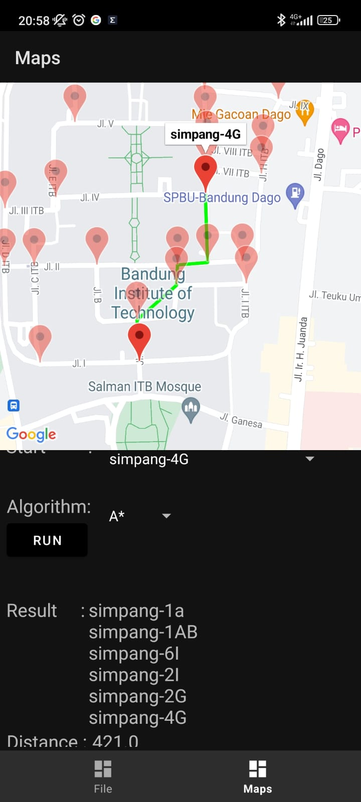

# Tugas Kecil 3 - Strategi Algoritma 
Tugas Kecil 3 IF2211 – Strategi Algoritma Tahun 2022/2023

## Table of Contents
* [General Info](#general-information)
* [Technologies Used](#technologies-used)
* [Algrithm Explanation](#algorithm-explanation)
* [Features](#features)
* [Screenshots](#screenshots)
* [How to Run](#how-to-run)
* [Project Status](#project-status)
* [Room for Improvement](#room-for-improvement)
* [Authors](#authors)

## General Information
### Perencanaan rute (route planning) adalah proses menentukan rute atau jalur terbaik dari suatu lokasi ke lokasi lain. Dalam perencanaan rute, terdapat dua jenis algoritma utama yang digunakan, yaitu algoritma tidak terinformasi (uninformed) dan algoritma terinformasi (informed). Terdapat UCS (Uniform Cost Search) sebagai algoritma uninformed search dan A* sebagai algoritma informed search. 

### Algoritma UCS (Uniform cost search) dan A* (atau A star) dapat digunakan untuk menentukan lintasan terpendek dari suatu titik ke titik lain. Pada tugas kecil 3 ini dihasilka penentuan lintasan terpendek berdasarkan peta Google Map jalan-jalan di kota Bandung. Dari ruas-ruas jalan di peta dibentuk graf. Simpul menyatakan persilangan jalan (simpang 3, 4 atau 5) atau ujung jalan.

## Technologies Used
- kotlin
- java
- gradle
- Android Studio
- Google Map API
- xml

## Algorithm Explanation
UCF adalah algoritma pencarian jalur yang menghitung biaya untuk mencapai setiap simpul dalam graf. Algoritma ini memilih simpul dengan biaya terkecil sebagai simpul yang akan dieksplorasi selanjutnya. UCF terus melakukan pencarian hingga mencapai simpul tujuan atau tidak ada simpul lagi yang dapat dijangkau. UCF cocok digunakan ketika tidak ada informasi heuristik yang tersedia. Perhitungan fungsi untuk UCF adalah sebagai berikut: f(n) = g(n) dengan g(n) adalah biaya untuk mencapai simpul n.

A* adalah algoritma yang menggabungkan teknik dari BFS dan Greedy Best First Search. Algoritma ini mencari jalur terpendek dari simpul awal ke simpul tujuan dengan mempertimbangkan biaya untuk mencapai simpul tertentu dan estimasi biaya yang diperlukan untuk mencapai simpul tujuan. Algoritma ini sangat efektif dalam menemukan jalur terpendek dan sering digunakan dalam aplikasi navigasi. A* juga merupakan sebuah algoritma pencarian jalur yang menggabungkan ide dari UCF dan heuristik. Algoritma ini mencari jalur terpendek dari simpul awal ke simpul tujuan dengan mempertimbangkan biaya untuk mencapai simpul tertentu dan estimasi biaya yang diperlukan untuk mencapai simpul tujuan. A* menggunakan fungsi heuristik untuk memperkirakan jarak yang tersisa hingga mencapai simpul tujuan. Algoritma ini sangat efektif dalam menemukan jalur terpendek dan sering digunakan dalam aplikasi navigasi. Perhitungan fungsi untuk A* adalah sebagai berikut: f(n) = g(n) + h(n) dengan g(n) adalah biaya untuk mencapai simpul n dan h(n) adalah estimasi biaya untuk mencapai simpul tujuan dari simpul n.

## Features
- Route planning
- UCS (Uniform Cost Search)
- A* (A star)
- Google Map Visualization
- Distance Calculation

## Screenshots
<!-- atur size dan center -->

## How to Run
1. Download the app from [here](src\apk\Nerb.apk)

## Project Status
<!-- Project is: _complete_  -->

## Room for Improvement

Room for improvement:
- speed up for algorithm
- algorithm optimization
- UI improvement
- add more features

## Authors
1. Nigel Sahl (13521043)         
2. Muhamad Aji Wibisono (13521095)   